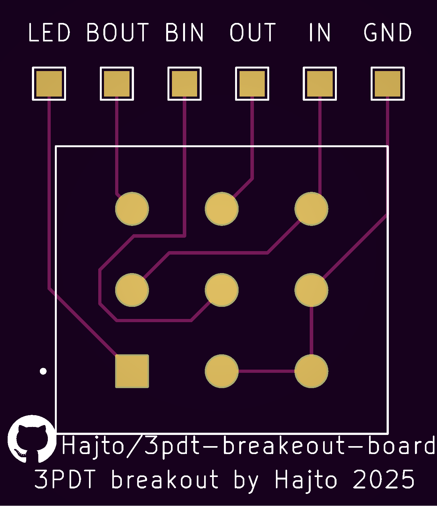

# 3PDT Switch Breakout Board

A simple and clean breakout board for 3PDT (3 Pole Double Throw) switches, designed for guitar effects pedals and audio applications.

## Overview

This breakout board provides a convenient way to integrate a 3PDT switch into your guitar effects pedal projects. The board features clearly labeled connection points and is designed for easy soldering and integration.

## Connections

The breakout board provides the following connection points:

- **BIN** - Board In (input from previous stage)
- **BOUT** - Board Out (output to next stage) 
- **IN** - Guitar In (input from guitar)
- **OUT** - Guitar Signal Out (output to amplifier)
- **LED** - LED connection for status indication
- **GND** - Ground connection

